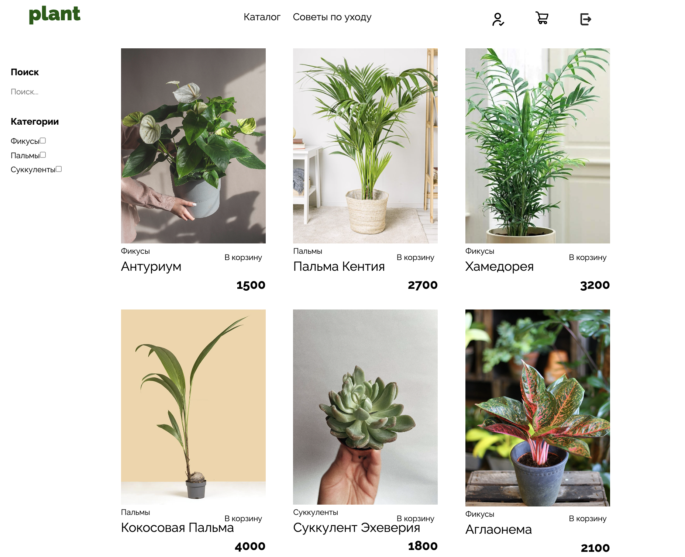
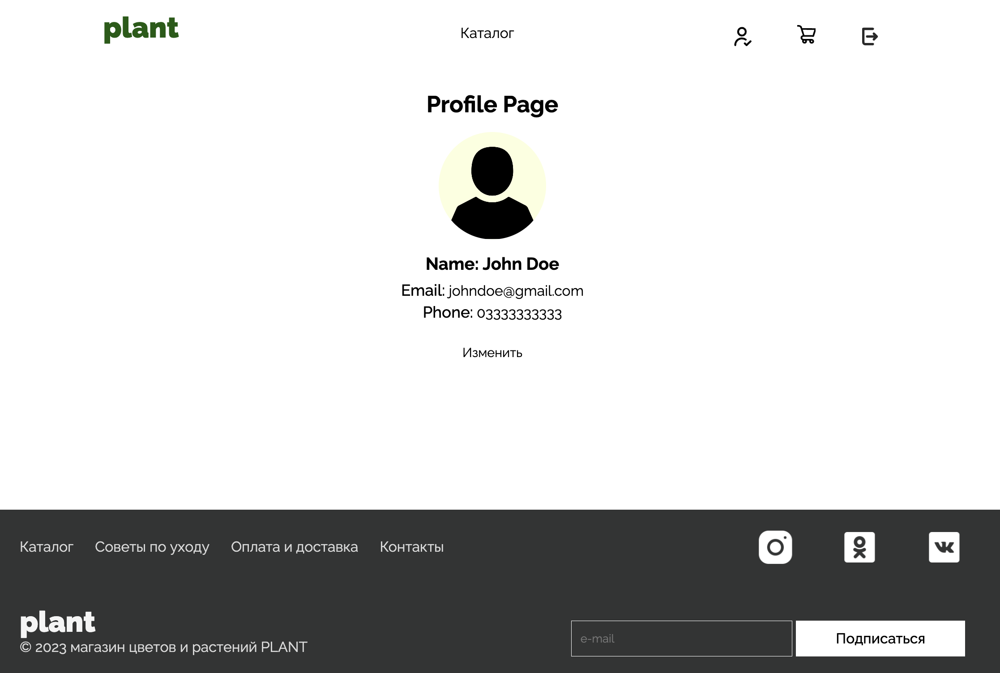

# Plant Shop

Это проект магазина растений, разработанный с использованием React и Redux Toolkit. В нем реализованы пагинация с помощью `react-paginate`, роутинг с помощью `react-router-dom`, а также используются mock-данные с `json-server` также присутсвует фильтрация.

## 1920px

## Технологии

- React
- Redux Toolkit
- TypeScript
- React Router DOM
- React Paginate
- Axios
- JSON Server

## Скрипты

- `npm start` — запуск приложения
- `npm run server` — запуск JSON Server на порту 8000
